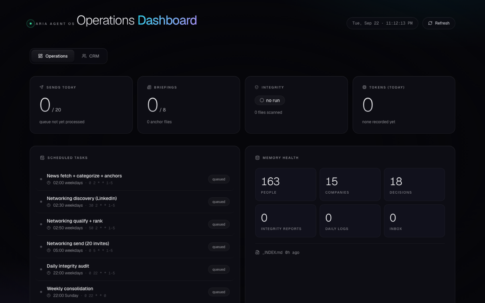
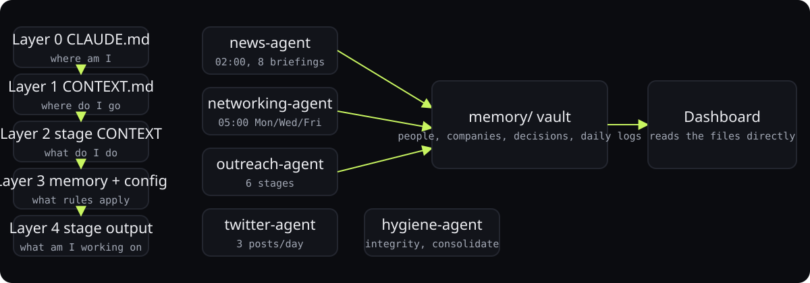

<div align="center">



# Aria Agent OS

**Five autonomous agents that run on a folder structure. No framework, no database: markdown files are the state.**

<p>
<a href="https://ibiraheel.com/p/aria-agent-os"></a>
</p>

<p>


</p>

</div>

<br>

> **139 personalised outreach messages sent, 174 people tracked**  
> for one operator running networking, news, outreach, Twitter, and vault hygiene on a schedule

> [!NOTE]
> This is the public edition: the agents, context layers, skills and workflows. The live system's memory (people, companies, run outputs) is private and not included.

## What it did

Networking agent sends up to 23 personalised LinkedIn requests per run on a Mon/Wed/Fri cadence; news agent produces eight daily briefings that feed it; Twitter agent posts three times a day with a Slack approval loop; hygiene agent audits the vault. Numbers read live from the OS folder by its dashboard.

<sub>Outcome: measured.</sub>

## How it works

<p align="center"></p>

1. Interpretable Context Methodology: the agent reads five layers of CONTEXT.md files and stops when it has enough, 2k to 8k tokens per task.
2. Agents are processes, people are nodes: one dossier per person in memory/, one engagement record per agent, linked both ways with wikilinks.
3. Pipeline state is encoded by moving a file between stage folders, so Obsidian's graph shows the funnel for free.
4. Six scheduled tasks drive the day; every run appends to a daily log the dashboard parses.
5. 1,646 markdown files and no service layer.

## Run it locally

The agents are Claude Code sessions, not a service: each one reads its folder's
`CLAUDE.md` and `CONTEXT.md` layers and writes markdown back. `_setup/wake-schedule-setup.sh`
installs the schedule. The read-only dashboard:

```bash
cd dashboard
npm install
npm start
```

## Repository layout

```
├── _setup/
│   └── wake-schedule-setup.sh
├── dashboard/
│   ├── public/
│   ├── package.json
│   ├── README.md
│   └── server.js
├── hygiene-agent/
│   ├── 01-integrity-check/
│   ├── 02-consolidate/
│   ├── 03-validate/
│   ├── _config/
│   ├── integrity/
│   ├── CLAUDE.md
│   └── README.md
├── memory/
│   └── templates/
├── networking-agent/
│   ├── 01-sources/
│   ├── 02-discovery/
│   ├── 03-qualify/
│   ├── 06-send/
│   ├── 07-track/
│   ├── 08-followup/
│   ├── _config/
│   ├── CLAUDE.md
│   └── README.md
├── news-agent/
│   ├── 01-fetch/
│   ├── 02-categorize/
│   ├── 03-anchor-generation/
│   ├── _config/
│   ├── CLAUDE.md
│   └── README.md
├── outreach-agent-arcadia/
│   ├── _config/
│   ├── dashboard/
│   ├── shared/
│   ├── skills/
│   ├── stages/
│   ├── workflows/
│   ├── CLAUDE.md
│   └── CONTEXT.md
├── twitter-agent/
│   ├── _config/
│   ├── CLAUDE.md
│   └── README.md
├── AGENTS.md
├── CLAUDE.md
├── DESIGN.md
└── README.md
```

---

<div align="center">

<sub>Built by <a href="https://github.com/ibi-raheel">Muhammad Ibrahim Raheel</a> · more work at <a href="https://ibiraheel.com">ibiraheel.com</a></sub>

</div>
